# Retail Bank Customer Churn & Lifetime Value (LTV) Diagnostic Analytics

An end-to-end churn analytics project on **real customer data**: the Kaggle *Bank Customer Churn* dataset, with 10,000 customers of a European retail bank. The questions it answers:

1. **How big is the problem?** Attrition rate, lost balances, revenue at risk.
2. **Why do customers leave?** Statistical testing, survival analysis, predictive modelling.
3. **What should the bank do about it?** Value-based targeting, retention actions and ROI scenarios.

**Stack:** Python (pandas · SciPy · lifelines · scikit-learn) for analytics · Next.js / React / TypeScript / Recharts for the interactive dashboard · Docker Compose for one-command reproducibility.

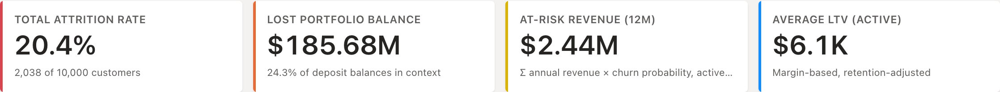

---

## Key findings

| # | Finding | Evidence |
|---|---|---|
| 1 | **Product holding is the #1 churn driver.** Customers with 3–4 products churn at 83–100%; 2-product customers at only 7.6% | χ² Cramér's V = 0.39 · top permutation importance |
| 2 | **Middle age is the risk zone.** Churn peaks at 56% for ages 50–59, versus 8% for under-30s | Welch t-test, Cohen's d = 0.74 |
| 3 | **Germany churns at 2x** France and Spain (32% vs 16–17%) | χ² p < 0.001 · log-rank p < 0.001 |
| 4 | **Inactive members churn at 1.9x** the rate of active members | χ² p < 0.001 · 5-year retention 82% vs 89% |
| 5 | **Some columns carry no signal:** tenure, credit score, salary, card type, satisfaction and loyalty points | Bonferroni-adjusted p ≈ 1 |
| 6 | **`Complain` is target leakage.** It matches the churn outcome 99.9% of the time, so it's excluded from the model | Single-feature ROC-AUC = 0.998 |
| 7 | **The churn model ranks risk well:** gradient boosting reaches ROC-AUC **0.862** (logistic regression 0.842) | 5-fold stratified out-of-fold validation |

---

## 1 · Executive attrition overview

### Attrition by geography & age tier
German customers churn at twice the rate of other markets in every age band. The 50–59 tier is the highest-risk group in all three countries.

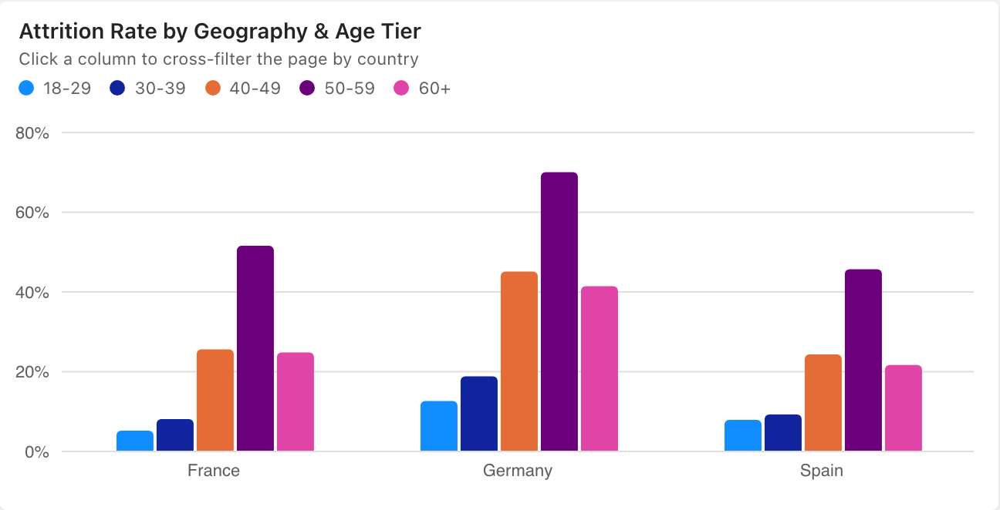

### Product holding distribution
Almost all customers hold 1 or 2 products. The small group holding 3–4 products churns almost entirely, which points to mis-selling or product fatigue. Two products is the sweet spot at 7.6% churn.

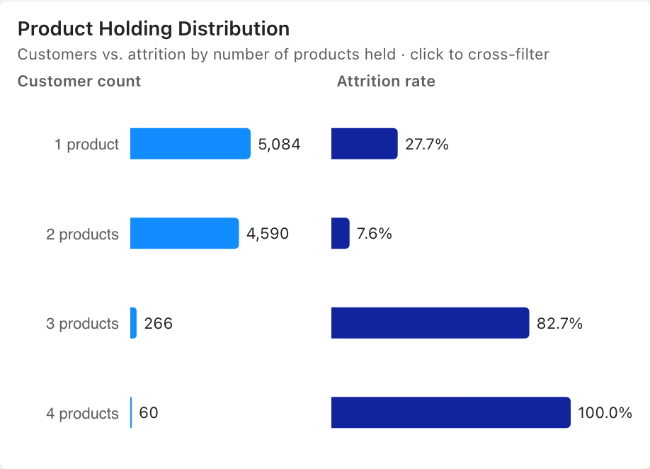

### Retention heatmap (Kaplan-Meier by tenure year)
This shows the share of each segment still banking after N years, estimated with Kaplan-Meier so that customers who are still active are counted correctly. The toggle switches the segment between age, country, products, activity and gender. Customers aged 50–59 fall to **8% retention by year 10**, while under-30s stay at 76%.

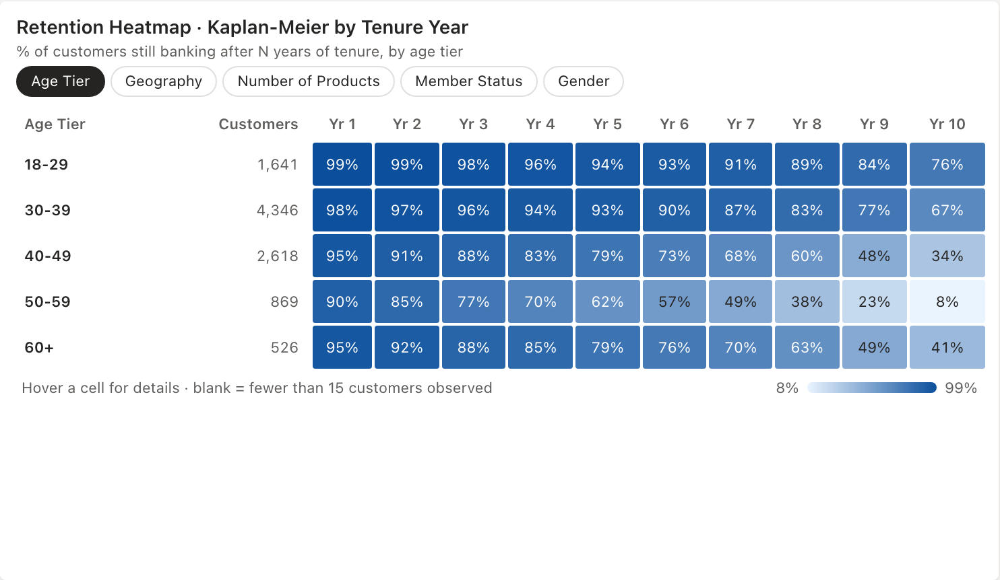

### Attrition by tenure
Attrition is flat at around 20% across tenure years. How long someone has been a customer doesn't protect against churn in this bank. The t-test confirms it (p ≈ 1).

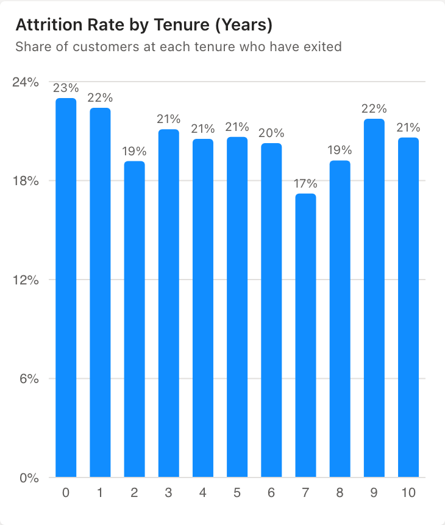

---

## 2 · Diagnostic & root-cause analytics

### Key influencers
Each factor's churn lift versus all other customers, tested with a two-proportion z-test (p < 0.05). Holding 3 or more products makes churn **4.7x** more likely. Being aged 50–59 raises it 3.3x, being in Germany 2.0x, and being inactive 1.9x. The *Top segments* tab combines conditions to find the highest-risk customer groups.

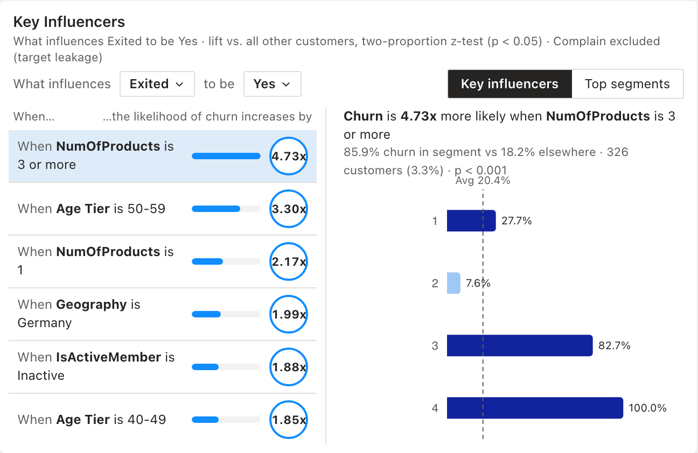

### Kaplan-Meier survival curves
Retention over tenure with 95% confidence bands, fitted with `lifelines`. Five-year retention is 89% for active members vs 82% for inactive members. By product count it's 95% for 2 products vs 49% for 3 products. Every segment split is significant under a multivariate log-rank test.

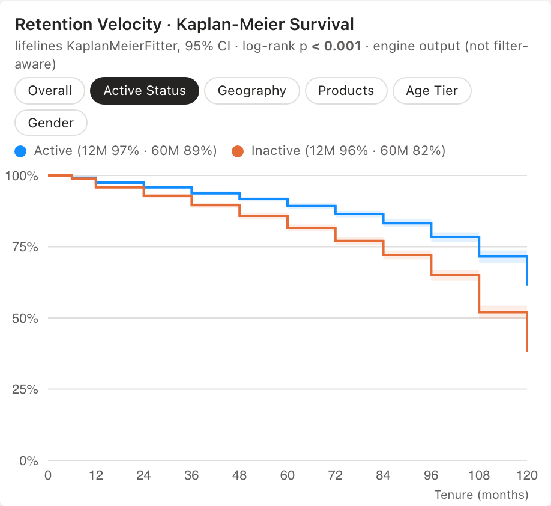

### Age vs. account balance
Churn concentrates among customers aged 45–64 with balances of $50K or more. That zone churns at **53%**, over 2.5x the portfolio average. These are exactly the customers the bank can least afford to lose.

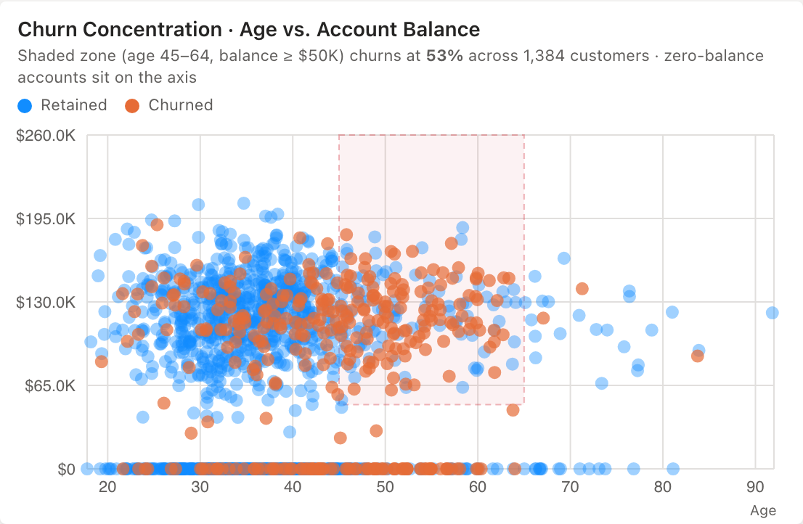

### Pareto: lost revenue concentration
Churned accounts ranked by annual revenue. The top 20% of churned accounts drive 32% of lost revenue. The loss is spread fairly broadly, so a campaign aimed only at premium accounts would miss most of the loss.

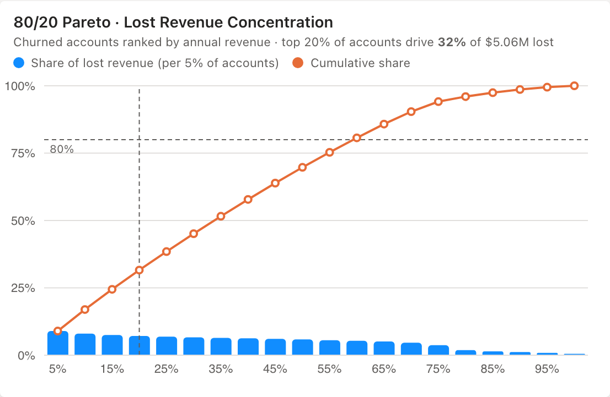

### Statistical hypothesis testing
χ² independence tests (with Cramér's V) for categorical drivers and Welch t-tests (with Cohen's d) for numeric drivers. P-values are Bonferroni-adjusted across all 15 tests. The leakage audit flags `Complain` as a post-outcome field.

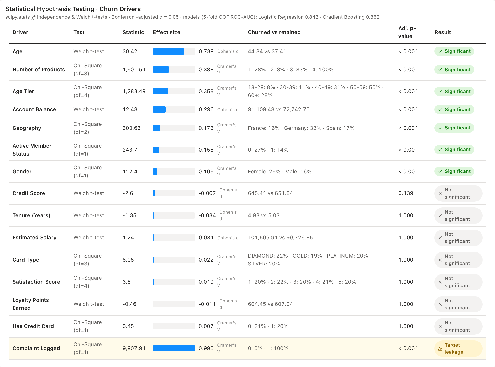

---

## 3 · Prescriptive retention & what-if planning

### What-if planner
Set a churn-reduction target for each value tier and a risk threshold for targeting. The planner recalculates in real time:
- The number of accounts targeted.
- Revenue saved over 12 months.
- The **LTV uplift** from lower churn probability.
- Campaign cost and programme ROI.

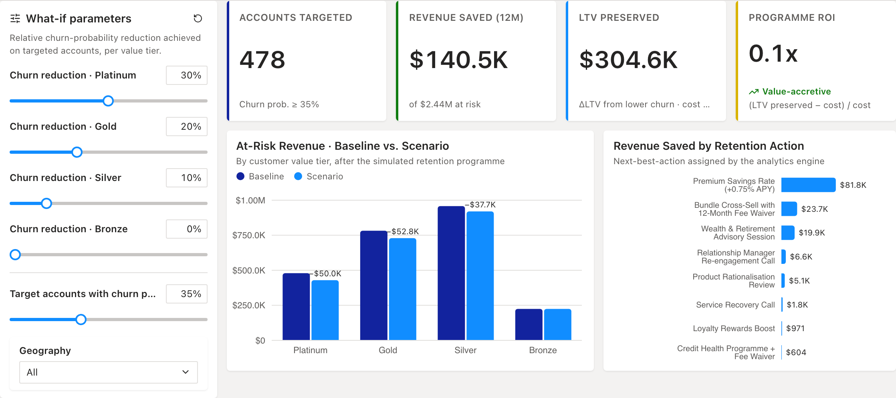

### High-value at-risk accounts
Silver-tier and above accounts whose churn probability passes the threshold. Each one has a recommended retention action and its expected value saved. The table is sortable and searchable, and clicking a row opens the customer detail view.

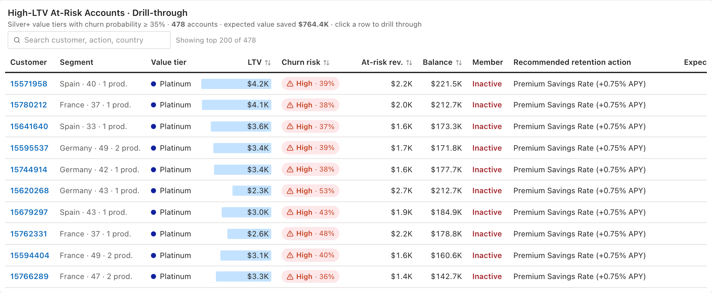

### Customer detail
A single-customer view:
- Profile and churn-probability gauge.
- The risk factors that apply to this customer.
- A comparison against retained and churned averages.
- The recommended action, with its save rate, cost and net expected value.

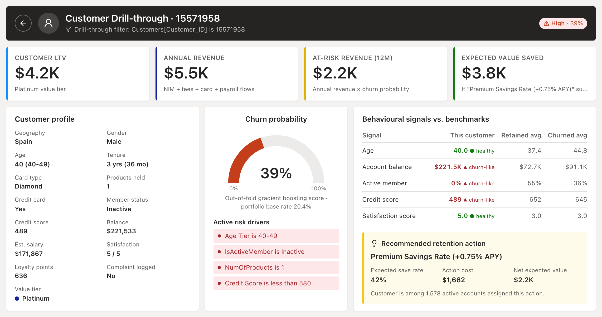

---

## Methodology

| Step | Detail |
|---|---|
| **0 · Ingestion & data quality** | Maps Kaggle columns to the engine schema and drops `RowNumber` and `Surname`. Checks nulls, duplicate IDs and value ranges; all pass. |
| **1 · Feature engineering** | Age tiers, tenure in months (tenure is recorded in whole years; year 0 is placed at 6 months), and a zero-balance flag. **Annual revenue** = 2.1% net interest margin on balance + $85 per product + card fee by card type + 0.35% yield on salary flows. |
| **2 · Leakage audit** | Single-feature ROC-AUC for every column. Any column at 0.95 or above is flagged and excluded from modelling. |
| **3 · Hypothesis testing** | χ² with Cramér's V and Welch t-tests with Cohen's d across 15 drivers, Bonferroni-corrected. |
| **4 · Survival analysis** | Kaplan-Meier with 95% CIs, overall and by segment, plus multivariate log-rank tests. |
| **5 · Propensity modelling** | Logistic regression vs. histogram gradient boosting on 5-fold stratified **out-of-fold** predictions, so every customer is scored by a model that never saw them. The better model is used for scoring. Logistic odds ratios and permutation importance are exported for interpretability. |
| **6 · LTV & risk scoring** | `LTV = m·r / (1 + d − r)`, where m = annual margin (62%), r = 1 − churn probability and d = 10%. Also produces at-risk revenue, risk tiers (Low → Critical), revenue-based value tiers (Bronze → Platinum) and a rule-based next-best retention action. |

The interactive measures (attrition %, KM retention, key-influencer lift, Pareto, what-if) are recalculated in the browser for the current filter selection. So every slicer and chart click updates all visuals instantly.

---

## Data source

| | |
|---|---|
| **Dataset** | [Bank Customer Churn · Kaggle (radheshyamkollipara)](https://www.kaggle.com/datasets/radheshyamkollipara/bank-customer-churn) |
| **File** | `Customer-Churn-Records.csv`: 10,000 rows × 18 columns |
| **Target** | `Exited` (1 = left the bank). Attrition rate 20.38% |

`scripts/fetch_kaggle_data.py` downloads the file from Kaggle's public API and validates the schema and row count. The dataset has no explicit redistribution licence, so **the raw file and its per-customer outputs aren't committed**. They're downloaded when the pipeline runs.

### Data dictionary

| Kaggle column | Description |
|---|---|
| `CustomerId` | Anonymous customer identifier |
| `CreditScore`, `Geography`, `Gender`, `Age` | Demographics and credit quality (France / Germany / Spain) |
| `Tenure` | Years as a customer; used as the survival duration |
| `Balance`, `NumOfProducts`, `HasCrCard`, `IsActiveMember`, `EstimatedSalary` | Account and product holdings |
| `Card Type`, `Point Earned` | Card tier and loyalty points |
| `Satisfaction Score` | 1–5 rating of complaint resolution |
| `Complain` | Complaint logged. **Target leakage; excluded from the model** |
| `Exited` | Target: 1 = churned |

### Limitations
- **Snapshot data.** There are no transaction histories or join dates, so retention is analysed over tenure rather than join-year cohorts.
- **Tenure is recorded in whole years**, so the survival curves step annually.
- **Revenue and LTV are illustrative.** They use standard retail-banking assumptions (documented in `model.json → assumptions`), because the dataset has no financial fields.

---

## Quick start

### Docker (one command)

```bash
docker compose -f docker/docker-compose.yml up --build
```

The `analytics` container downloads the dataset and runs the engine. The `web` container then serves the dashboard at **http://localhost:3000**.

### Local (Node 20+ and Python 3.9+)

```bash
python3 -m venv .venv && source .venv/bin/activate
pip install -r scripts/requirements.txt
python scripts/fetch_kaggle_data.py        # -> data/raw/Customer-Churn-Records.csv
python scripts/analytical_engine.py        # -> app/data/{customers,model}.json

cd app && npm install && npm run dev       # http://localhost:3000
```

**If Kaggle rejects the anonymous download**, create an API token (kaggle.com → Settings → API) and export `KAGGLE_USERNAME` and `KAGGLE_KEY`.

## Project structure

```
├── scripts/
│   ├── fetch_kaggle_data.py      download + validate the Kaggle dataset
│   ├── analytical_engine.py      quality · leakage · tests · survival · models · LTV
│   └── requirements.txt
├── app/                          Next.js dashboard (TypeScript, Tailwind CSS, Recharts)
│   └── src/
│       ├── lib/measures.ts       filter-aware measures (KM, lift, Pareto, what-if)
│       ├── context/              filter state, cross-filtering, drill-through
│       └── components/           charts and report pages
├── docker/                       analytics + web images, docker-compose.yml
└── docs/charts/                  README figures
```
