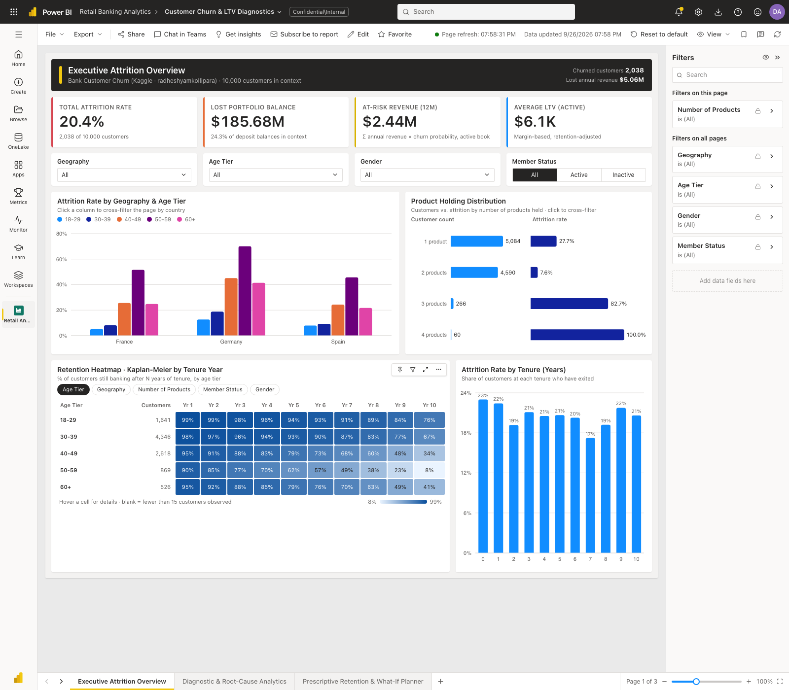
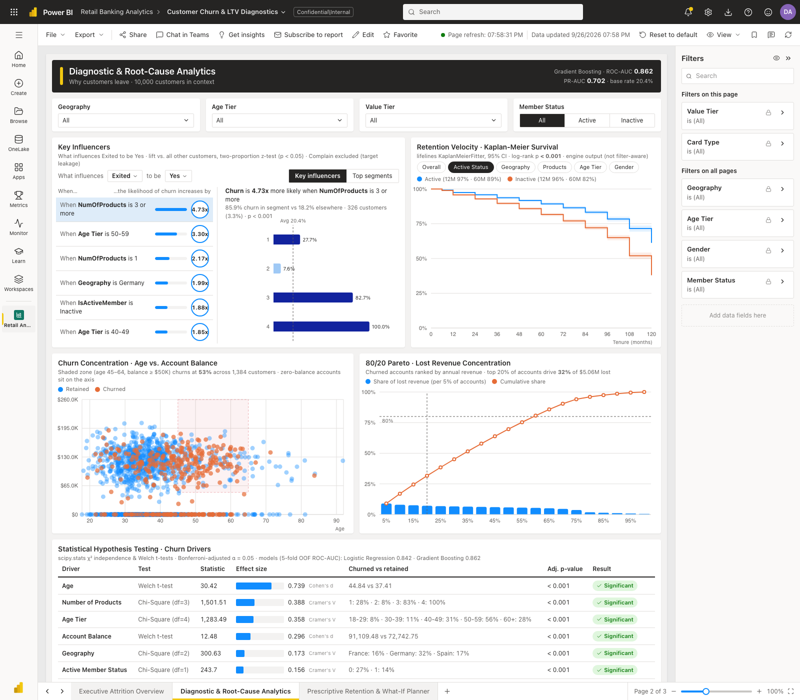
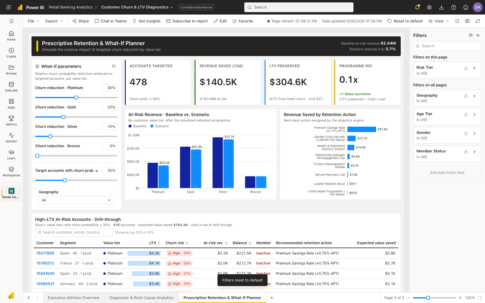
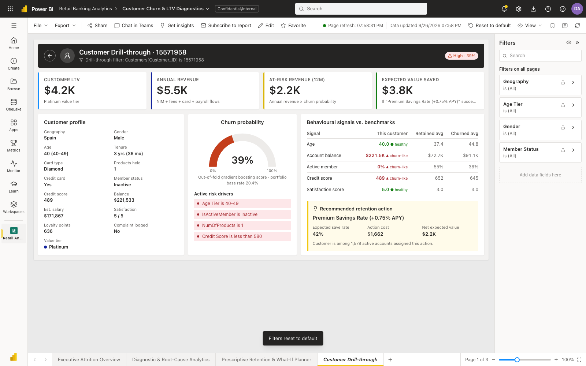
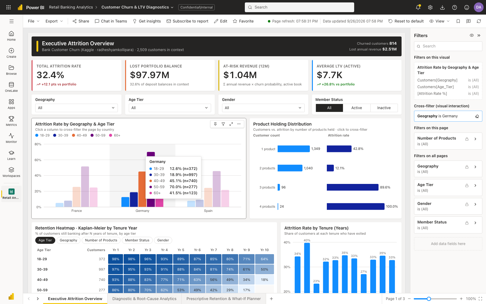

# Retail Bank Customer Churn & Lifetime Value (LTV) Diagnostic Analytics Dashboard

An end-to-end churn analytics project on **real customer data**: the Kaggle *Bank Customer Churn* dataset, with 10,000 customers of a European retail bank.

- A **Python engine** (pandas · scipy · lifelines · scikit-learn) validates the data, audits it for target leakage, tests churn drivers, runs survival analysis, compares churn models and scores lifetime value.
- A **Next.js "Power BI Web Simulator"** presents the results in a report that looks and behaves like the Power BI Service. It runs on localhost and needs no Power BI licence.



---

## Data source

| | |
|---|---|
| **Dataset** | [Bank Customer Churn · Kaggle (radheshyamkollipara)](https://www.kaggle.com/datasets/radheshyamkollipara/bank-customer-churn) |
| **File** | `Customer-Churn-Records.csv`: 10,000 rows × 18 columns |
| **Target** | `Exited` (1 = the customer left the bank). Attrition rate is **20.38%** |
| **Quality** | No nulls, no duplicate customer IDs, no out-of-range values (checked on every run) |

`scripts/fetch_kaggle_data.py` downloads the file from Kaggle's public API, validates the schema and row count, and prints a SHA-256 fingerprint. The dataset has no explicit redistribution licence, so **the raw file and its row-level derivatives are git-ignored**. They're fetched when the pipeline runs, and only code and aggregate screenshots live in this repo. `Surname` and `RowNumber` are dropped on ingestion.

## Key findings

| Finding | Evidence |
|---|---|
| **Product holding is the #1 driver.** 3–4 products churn at 83–100%; 2 products at only 7.6% | χ² Cramér's V 0.39 · top permutation importance |
| **Middle age is the risk zone.** Churn peaks at 56% for ages 50–59 | Welch t (Cohen's d 0.74) · the model's quadratic age term |
| **Germany churns at 2x** France and Spain (32% vs 16–17%) | χ² p < 0.001 · log-rank p < 0.001 |
| **Inactive members churn at 1.9x** active ones | χ² V 0.16 · log-rank p < 0.001 |
| **Some columns carry no signal:** tenure, credit score, salary, card type, satisfaction score and loyalty points | Bonferroni-adjusted p ≈ 1 |
| **`Complain` is target leakage.** It matches `Exited` 99.9% of the time (single-feature ROC-AUC 0.998) | The leakage audit flags it and the engine excludes it from the model |

The last finding matters. Keeping `Complain` would give a "99.8% accurate" model that is useless in production, because the complaint is recorded at or after exit. The engine detects this automatically, and the dashboard flags it in the hypothesis-testing table.

---

## Analytics pipeline

| Step | What it does |
|---|---|
| **0 · Ingestion & data quality** | Maps Kaggle columns to the engine schema, drops personal and index columns, and checks nulls, duplicates and value ranges (`model.json → data_quality`). |
| **1 · Feature engineering** | Age tiers, tenure in months (Kaggle records whole years; year 0 → 6 months), zero-balance flag, and **annual revenue**: 2.1% NIM on balance + $85 per product + card fee by card type + 0.35% salary-flow yield. |
| **2 · Leakage audit** | Single-feature ROC-AUC for every column. Anything ≥ 0.95 is flagged and excluded from modelling. |
| **3 · Hypothesis testing** | χ² independence tests with Cramér's V, and Welch t-tests with Cohen's d, across 15 drivers. P-values are Bonferroni-adjusted. |
| **4 · Survival analysis** | `lifelines` Kaplan-Meier retention over tenure with 95% CIs, overall and by active status, geography, products, age tier and gender, plus multivariate log-rank tests. |
| **5 · Propensity models** | Logistic regression vs. gradient boosting, compared on **5-fold stratified out-of-fold** predictions. The winner (gradient boosting, ROC-AUC **0.862**; logistic 0.842) scores every customer on data it never saw. Logistic odds ratios and permutation importance are exported for interpretability. |
| **6 · LTV & risk scoring** | `LTV = m·r / (1 + d − r)` with r = 1 − churn probability and d = 10%. Also computes at-risk revenue, risk tiers, revenue-based value tiers, and a rule-based next-best retention action. |

The financial assumptions (NIM, fees, margin, discount rate) are published in `model.json → assumptions`. They're illustrative, because the dataset doesn't contain revenue.

## Report pages

1. **Executive Attrition Overview**
   - KPI cards.
   - Attrition by geography × age tier (click to cross-filter).
   - Product-holding small multiples.
   - **Kaplan-Meier retention heatmap** by segment and tenure year.
   - Attrition by tenure.
2. **Diagnostic & Root-Cause Analytics**
   - Simulated **Key Influencers** visual: lift with two-proportion z-tests, plus *Top segments*.
   - KM survival curves with CI bands.
   - Age vs. balance churn-concentration scatter.
   - Pareto of lost revenue.
   - Hypothesis-testing table with the leakage flag.
3. **Prescriptive Retention & What-If Planner**
   - Per-tier churn-reduction sliders and a targeting threshold.
   - Live revenue saved, LTV uplift, cost and ROI.
   - Savings by action.
   - Sortable **drill-through table** of high-value at-risk accounts.
4. **Customer Drill-through** (hidden page)
   - Profile, churn-probability gauge and active risk drivers.
   - Benchmarks vs. retained and churned averages.
   - The recommended action with its expected value.

| | |
|---|---|
|  |  |
|  |  |

---

## Quick start

### Option A: Docker (one command)

```bash
docker compose -f docker/docker-compose.yml up --build
```

The `analytics` container downloads the Kaggle dataset and runs the engine. When it finishes, the `web` container starts. Open **http://localhost:3000**.

### Option B: Local (Node 20+ and Python 3.9+)

```bash
# 1. Data + analytics
python3 -m venv .venv && source .venv/bin/activate
pip install -r scripts/requirements.txt
python scripts/fetch_kaggle_data.py        # -> data/raw/Customer-Churn-Records.csv
python scripts/analytical_engine.py        # -> app/data/{customers,model}.json

# 2. Dashboard
cd app
npm install
npm run dev                                # http://localhost:3000
```

**If Kaggle rejects the anonymous download**, create an API token (kaggle.com → Settings → API) and export `KAGGLE_USERNAME` and `KAGGLE_KEY`, or place the CSV at `data/raw/Customer-Churn-Records.csv` yourself.

If you re-run the engine while the app is running, click the **Refresh** icon in the action bar. The dashboard reads the JSON at request time, so it doesn't need a rebuild.

---

## Architecture

```
Kaggle API ──► scripts/fetch_kaggle_data.py ──► data/raw/Customer-Churn-Records.csv
                                                        │
┌─────────────────── scripts/analytical_engine.py ──────▼───────────┐
│ 0 quality checks   1 features   2 leakage audit                   │
│ 3 χ² / Welch t   4 Kaplan-Meier + log-rank                        │
│ 5 LR vs GBM (OOF)   6 LTV · risk · next-best-action               │
│        ├─► app/data/customers.json  (row-level fact table)        │
│        ├─► app/data/model.json      (tests, survival, models)     │
│        └─► data/processed/customers_enriched.csv                  │
└───────────────────────────────────────────────────────────────────┘
                              │  GET /api/data/:dataset  (read at request time)
┌──────────────────────── app/ (Next.js 16 · React 19) ─────────────┐
│ context/ReportContext   filter context: report/page filters,      │
│                         cross-filter, focus, zoom, drill-through  │
│ lib/measures.ts         "DAX" measures evaluated per filter ctx   │
│ components/shell/*      Power BI service chrome                   │
│ components/visuals/*    Recharts visuals in PBI visual containers │
│ components/pages/*      the four report pages                     │
└───────────────────────────────────────────────────────────────────┘
```

**Design choice:** the heavy statistics run once in Python and are shipped as a semantic model. Measures such as attrition %, KM retention, key-influencer lift, Pareto and the what-if simulation are computed in the browser against the current filter context, the same way Power BI evaluates DAX. That's why every slicer, filter-pane card and cross-filter updates the visuals instantly.

### Repository layout

```
├── app/                      Next.js dashboard (TypeScript, Tailwind CSS v4, Recharts, Lucide)
│   ├── data/                 engine output served by /api/data/* (git-ignored)
│   └── src/{app,components,context,lib}
├── scripts/
│   ├── fetch_kaggle_data.py
│   ├── analytical_engine.py
│   └── requirements.txt
├── docker/
│   ├── Dockerfile.analytics  python:3.11-slim engine image
│   ├── Dockerfile.web        multi-stage Next.js standalone image
│   └── docker-compose.yml
├── data/                     raw + processed CSVs (git-ignored)
└── docs/screenshots/
```

## Data dictionary

| Kaggle column | Engine column | Description |
|---|---|---|
| `CustomerId` | `Customer_ID` | Anonymous customer identifier |
| `CreditScore`, `Geography`, `Gender`, `Age` | same | Demographics and credit quality (France / Germany / Spain) |
| `Tenure` | `Tenure`, `Tenure_Months` | Years as a customer; the survival duration |
| `Balance`, `NumOfProducts`, `HasCrCard`, `IsActiveMember`, `EstimatedSalary` | same | Account and product holdings |
| `Card Type`, `Point Earned` | `Card_Type`, `Points_Earned` | Card tier and loyalty points |
| `Satisfaction Score` | `Satisfaction_Score` | 1–5 rating of complaint resolution |
| `Complain` | `Complain` | Complaint logged. **Target leakage; excluded from the model** |
| `Exited` | `Churn_Status` | Target: 1 = left the bank |
| *(engine)* | `Churn_Probability`, `Annual_Revenue`, `LTV`, `At_Risk_Revenue`, `Risk_Tier`, `Value_Tier`, `Recommended_Action` | Scoring outputs |

## Limitations

- **Snapshot data.** There are no transaction histories or join dates, so behavioural decay and true join-year cohorts can't be observed. The retention heatmap uses Kaplan-Meier over tenure by segment instead.
- **Tenure is whole years**, so the survival curves step annually.
- **Revenue and LTV use illustrative banking assumptions**, because the dataset has no financials.

---

## Using the simulator

- **Slicers** on the canvas sync with the *Filters on all pages* cards in the filter pane.
- **Page-level filters** (for example *Card Type* on page 2) apply only to that page.
- **Click a column** in *Attrition by Geography* or *Product Holding* to cross-filter the page. Click it again to clear.
- **Hover a visual** for its header: filter peek, **focus mode**, and a **⋯** menu with *Show as a table* and *Export data*.
- **Click a row** in the at-risk table to drill through to the customer. The **←** button returns you.
- **Export → Analyze in Excel** downloads the currently filtered customer table as CSV.

> *Disclaimer:* this is an independent portfolio project that recreates the look of the Power BI Service UI for demonstration purposes. It is not affiliated with or endorsed by Microsoft. The dataset belongs to its Kaggle publisher and is downloaded at runtime, not redistributed.
